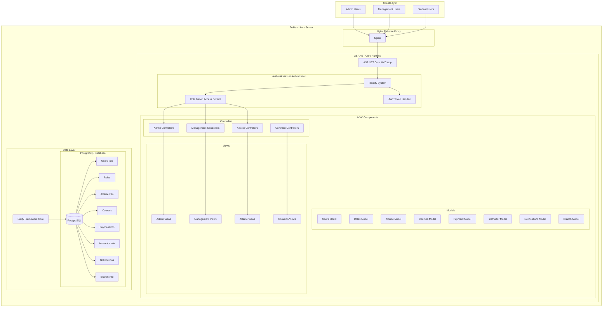

```mermaid
graph TD
    subgraph "Client Layer"
        A[Admin Users]
        M[Management Users]
        S[Student Users]
    end

    subgraph "Debian Linux Server"
        subgraph "Nginx Reverse Proxy"
            NGX[Nginx]
        end

        subgraph "ASP.NET Core Runtime"
            APP[ASP.NET Core MVC App]
            
            subgraph "Authentication & Authorization"
                AUTH[Identity System]
                RBAC[Role Based Access Control]
                JWT[JWT Token Handler]
            end

            subgraph "MVC Components"
                subgraph "Controllers"
                    AC[Admin Controllers]
                    MC[Management Controllers]
                    SC[Athlete Controllers]
                    CC[Common Controllers]
                end
                
                subgraph "Models"
                    direction BT
                    UTM[Users Model]
                    RTM[Roles Model]
                    STM[Athlete Model]
                    CTM[Courses Model]
                    GTM[Payment Model]
                    ITM[Instructor Model]
                    NTM[Notifications Model]
                    BRM[Branch Model]
                end
                
                subgraph "Views"
                    AV[Admin Views]
                    MV[Management Views]
                    SV[Athlete Views]
                    CV[Common Views]
                end
            end
        end

        subgraph "Data Layer"
            EF[Entity Framework Core]
            
            subgraph "PostgreSQL Database"
                PG[(PostgreSQL)]
                UT[Users Info]
                RT[Roles]
                ST[Athlete Info]
                CT[Courses]
                GT[Payment info]
                IT[Instructor info]
                NT[Notifications]
                BR[Branch info]
            end
        end
    end

    A --> NGX
    M --> NGX
    S --> NGX
    NGX --> APP
    APP --> AUTH
    AUTH --> RBAC
    AUTH --> JWT
    
    RBAC --> AC
    RBAC --> MC
    RBAC --> SC
    
    AC --> AV
    MC --> MV
    SC --> SV
    CC --> CV
    
    EF --> PG
    PG --> UT
    PG --> RT
    PG --> ST
    PG --> CT
    PG --> GT
    PG --> IT
    PG --> NT
    PG --> BR
```
